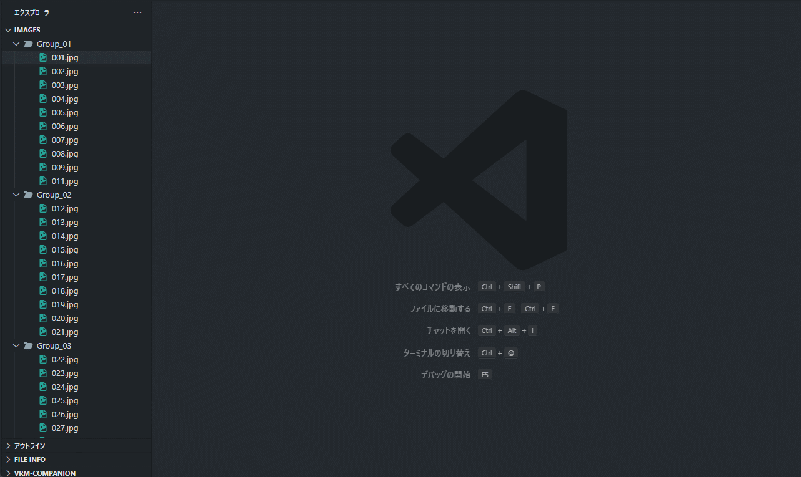

# Image Controller

Quickly zapping through large collections of images across multiple directories.

## Key Benefits

**Lightning-fast image zapping** - Navigate through hundreds of images with simple arrow keys  
**Seamless folder traversal** - Jump between folders without losing your viewing context  
**Direct manipulation** - Drag, zoom, and rotate images intuitively  

## Features

### Basic Functions
- Display image files (PNG, JPG, JPEG, GIF, BMP, WebP, SVG, ICO) in the editor
- Fast image loading and display

### Navigation
- **Right Arrow**: Instantly jump to next image in the same folder
- **Left Arrow**: Instantly jump to previous image in the same folder  
- **Ctrl+Up**: Move to previous folder and show its first image
- **Ctrl+Down**: Move to next folder and show its first image
- **Rapid zapping**: Navigate through entire image collections with just arrow keys

### Image Operations
- **Mouse Drag**: Move image
- **Mouse Wheel**: Zoom in/out
- **Ctrl+R**: Rotate image (90 degrees)
- **Reset**: Reset zoom and rotation

### File Operations
- **Delete Key**: Delete image (with confirmation dialog)
- **Ctrl+C**: Copy image path

### Toolbar
Toolbar displayed at the top-right of the image allows all operations via button clicks:
- ◀▶ Navigate to previous/next image
- 🔽🔼 Navigate to previous/next folder
- ↻ Rotate
- ⌂ Reset
- 📋 Copy
- 🗑 Delete

## Usage

1. Right-click on any image file in your project
2. Select "Open With" → "Image Controller"
3. **Start zapping!** Use arrow keys to rapidly browse through your entire image collection
4. Use Ctrl+Up/Down to seamlessly move between different folders

## Perfect for:

- 📸 **Photo collections** - Browse vacation photos across multiple folders
- 🎨 **Design assets** - Review UI mockups, icons, and graphics quickly  
- 📚 **Comic/Manga reading** - Page through sequential images effortlessly
- 🖼️ **Art galleries** - Curate and review artwork collections
- 🔍 **Image comparison** - Quickly switch between similar images

## Settings

- `imageController.zoomStep`: Zoom step when using mouse wheel (default: 0.1)
- `imageController.maxZoom`: Maximum zoom level (default: 10)  
- `imageController.minZoom`: Minimum zoom level (default: 0.1)

## Keyboard Shortcuts

| Key | Action |
|-----|--------|
| Left Arrow | Previous image |
| Right Arrow | Next image |
| Ctrl+Up | Previous folder |
| Ctrl+Down | Next folder |
| Ctrl+R | Rotate image |
| Ctrl+C | Copy image path |
| Delete | Delete image |
| Mouse Wheel | Zoom in/out |
| Mouse Drag | Move image |

## Requirements

- Visual Studio Code 1.74.0 or higher

## License

This extension is released under the MIT License.
